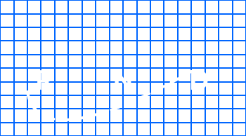

<p align="center">

</p>

# react-native-devices
<p>React Native helper for iOS devices.</p>

### Usage
```javacript
yarn add react-native-devices
```
```javacript
import { devices} from 'react-native-devices'
```

#### IF_ (function) returns a or b:
```javacript
<View
  style={{
    ...devices.IF_X(
      {
        top: layout.canvasTopMargin + 100 + 
      },
      {
        top: layout.canvasTopMargin + 50 + 
      }
    )
  }}
>
```
#### IS_ (bool)
```javacript
const top = device.IS_X ? 100 : 0
```
### Helpers

| Functions        | ...        |
|------------------|------------|
| IF_X             | if, if not |
| IF_PLUS_6_6S_7_8 | if, if not |
| IF_6_6S_7_8      | if, if not |
| IF_5_5S_5C_SE    | if, if not |
| IF_4_4S          | if, if not |
| IF_2G_3G_3GS     | if, if not |

| Bools            | 
| ------------------| 
| IS_X  |  
| IS_PLUS_6_6S_7_8  |  
| IS_6_6S_7_8  |  
| IS_5_5S_5C_SE  |  
| IS_4_4S  |  
| IS_2G_3G_3GS  |  

### Why?
There are others out there like react-native-iphone-x-helper. Difference is this one gives you more stuff.

