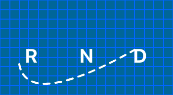

<p align="center">

</p>

# react-native-devices

<p>React Native helper for iOS devices.</p>

### Usage

```javacript
yarn add react-native-devices
```

```javacript
import { devices} from 'react-native-devices'
```

#### IF\_ (function) returns a or b:

```javacript
/* Check if iPhoneX, if not - check if iPhone Plus, else others */

<View
  style={{
    ...devices.IF_X(
      {
        top: 100
      },
      {
        ...devices.IF_PLUS_6_6S_7_8({
          top: 50
        }, {
          top: 25
        })
      }
    )
  }}
>
```

#### IS\_ (bool)

```javacript
const top = device.IS_X ? 100 : 0
```

### Helpers

| Functions        | arguments  | comments                     |
| ---------------- | ---------- | ---------------------------- |
| IF_X             | if, if not |                              |
| IF_PLUS_6_6S_7_8 | if, if not |                              |
| IF_6_6S_7_8      | if, if not |                              |
| IF_5_5S_5C_SE    | if, if not |                              |
| IF_4_4S          | if, if not |                              |
| IF_2G_3G_3GS     | if, if not |                              |
| IF_TABLET        | if, if not |                              |
| IF_IPAD          | if, if not | (Mini, 1st & 2nd Generation) |
| IF_IPAD_MINI     | if, if not | (2nd, 3rd & 4th Generation)  |
| IF_IPAD_AIR      | if, if not | (1st & 2nd Generation)       |
| IF_IPAD_RETINA   | if, if not | (3rd & 4th Generation)       |
| IF_IPAD_PRO      | if, if not |                              |

| Bools            |
| ---------------- |
| IS_X             |
| IS_PLUS_6_6S_7_8 |
| IS_6_6S_7_8      |
| IS_5_5S_5C_SE    |
| IS_4_4S          |
| IS_2G_3G_3GS     |
| IS_TABLET        |
| IS_IPAD          |
| IS_IPAD_MINI     |
| IS_IPAD_AIR      |
| IS_IPAD_RETINA   |
| IS_IPAD_PRO      |

### Why?

There are others out there (like the syntax inspiration for RND - react-native-iphone-x-helper).<br>
Difference is this one gives you more stuff.
